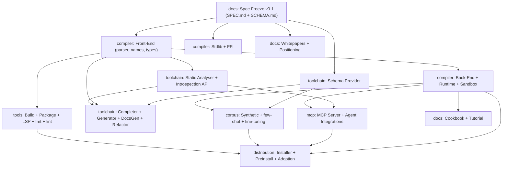

# Orthon — Global Roadmap

> Org-wide, high-level roadmap for the Orthon language project.
> This file lives in its own repository (`roadmap/`) and lists
> **high-level tasks** only — one component per repository under the
> `orthon-lang` GitHub organization, with dependencies and rough
> timelines. Per-phase detail lives in each component repo
> (e.g. `docs/when/ROADMAP.md` and `docs/.planning/`).
>
> **Status:** Working draft. Durations are planning assumptions, not
> commitments. Live per-component status is tracked in each repo.

---

## 1. Purpose and Scope

Orthon spans more than a language specification. The end goal is a
first-class, convenient, popular execution substrate for LLM agents —
on par with Python, Node.js, and bash as a tool that agents reach for
automatically. See `docs/notes/llm-native-tool-strategy.md` for the
strategy behind this roadmap.

This roadmap covers **all** high-level work streams:

- Language specification (semantics, taxonomy, syntax, `SPEC.md`, `SCHEMA.md`)
- Compiler and runtime (incl. sandboxed execution)
- Standard library and FFI
- LLM toolchain (Schema Provider, Static Analyser, Introspection API, …)
- Build system and developer tools (package manager, formatter, linter, LSP)
- MCP server and agent integrations
- Cookbook and tutorial
- Corpus, few-shot packs, and fine-tuning data
- Distribution, installation, and adoption
- Whitepapers and positioning

Out of scope here: per-phase task breakdown (each repo owns its own),
and day-to-day status (each repo's issue tracker / `.planning/`).

---

## 2. Organization Model

Single GitHub organization `orthon-lang`, **one repository per
component**. Components are versioned and released independently, but
all trace to the frozen language specification as the single source of
truth.

| Repo | Component | Purpose |
|------|-----------|---------|
| `docs` | Specification | Language design: semantics, taxonomy, syntax, `SPEC.md`, `SCHEMA.md`, cookbook, tutorial, whitepapers. **Exists.** |
| `roadmap` | Global roadmap | This file — org-wide high-level tasks and dependencies. |
| `compiler` | Compiler & runtime | Parser, name resolution, type system, IR, codegen, interpreter/AOT, runtime, sandboxed execution, standard library, FFI. |
| `toolchain` | LLM toolchain | Schema Provider, Static Analyser, Introspection API, Code Completer, Code Generator, Documentation Generator, Refactor/Migration. |
| `mcp` | MCP server | MCP surface over schema / introspect / analyse / execute, plus agent-framework integrations. |
| `tools` | Developer tools | Build system, package manager, formatter, linter, LSP. |
| `corpus` | Training data | Synthetic corpus, few-shot and idiom packs, fine-tuning datasets. |
| `distribution` | Distribution & adoption | Installer, prebuilt binaries, preinstall in agent sandboxes, adoption docs. |

Optional splits (decide at Stage 0): `stdlib` and `ffi` may live inside
`compiler` or split out; `website` may live inside `docs`.

---

## 3. Dependency Graph



**Note on ordering:** the LLM toolchain is treated as a *primary
product*, not an add-on. Schema Provider + Static Analyser +
Introspection API are pulled **ahead of the compiler back-end** — a
language with schema + analyser but no codegen is already useful to
agents as a verify tool (see `llm-native-tool-strategy.md`).

---

## 4. Delivery Stages

Stages are dependency-ordered. Tasks within a stage that have no
inter-stage dependency may run in parallel.

### Stage 0 — Org Foundation
**Depends on:** nothing. **Repo:** `roadmap` (+ all).

- [ ] Create the `orthon-lang` GitHub organization.
- [ ] Create `roadmap` repo; land this file.
- [ ] Decide cross-repo conventions: license, commit prefixes, CI, release cadence, single-source-of-truth linking to `docs`.
- [ ] Create skeletons for `compiler`, `toolchain`, `mcp`, `tools`, `corpus`, `distribution`.
- [ ] Decide `stdlib` / `ffi` / `website` split (in-`compiler` vs. separate).

### Stage 1 — Language Specification Freeze (v0.1)
**Depends on:** nothing (already in flight). **Repo:** `docs`.

The anchor for the entire org. High-level tasks:

- [ ] Phase 5 — Syntax Design (derived from accepted semantics).
- [ ] Phase 6 — Cross-Cutting Review (interaction matrix, conflict registry).
- [ ] Phase 7 — Execution & Optimization Model (incl. Execution Program boundary, sandbox contract).
- [ ] Phase 8 — Evolution Model, consistency review, `SPEC.md`, `SCHEMA.md`, validation, **Freeze**.
- [ ] `SCHEMA.md` — machine-readable grammar + type + stdlib contracts (the Schema Provider's input).

Detail lives in `docs/when/ROADMAP.md`; live status in `docs/.planning/`.
Freeze is the T0 anchor for all downstream timelines.

### Stage 2 — Schema Provider
**Depends on:** Stage 1 (`SCHEMA.md`). **Repo:** `toolchain`.

- [ ] Serve grammar, type-system, stdlib, and strategy schemas as structured, versioned, deterministic data.
- [ ] Encode non-obvious constraints (e.g. 1-based indexing) explicitly in the schema.
- [ ] Strategy-parametric output (adjusts to active Policy values).
- [ ] Compact "schema pack" sized for LLM context windows.

Runs in parallel with Stage 3.

### Stage 3 — Compiler Front-End
**Depends on:** Stage 1 (frozen spec). **Repo:** `compiler`.

- [ ] Lexer + parser (from the frozen grammar).
- [ ] Name resolution and scope management.
- [ ] Type checker (type system from `TYPE_SYSTEM.md`).
- [ ] AST + stable internal representation for downstream tooling.

Long pole of the whole roadmap.

### Stage 4 — Static Analyser + Introspection API
**Depends on:** Stage 3. **Repo:** `toolchain`.

- [ ] Static Analyser: type errors, policy/strategy violations, common LLM-generation errors (hallucinated APIs, wrong lifetimes, mismatched allocation).
- [ ] Structured diagnostics with machine-readable codes + repair hints (`Error Policy = LLM`).
- [ ] Introspection API: type queries, completions, scope inspection, symbol docs — stateless and deterministic.

### Stage 5 — Compiler Back-End + Runtime + Sandbox
**Depends on:** Stage 3; spec Phase 7 (execution model). **Repo:** `compiler`.

- [ ] IR and code generation (interpreter first, then AOT / WASM / OCI).
- [ ] Runtime.
- [ ] Sandboxed execution — enforce permissions, resource limits, and timeouts declared in the Execution Program.
- [ ] Execution Program artifact support (source + context + execution contract in one artifact).

### Stage 6 — Standard Library + FFI
**Depends on:** Stage 1 (docs M2). **Repo:** `compiler` (or `stdlib`).

- [ ] Collections, I/O, formatting, etc.
- [ ] FFI: C ABI interop, embedding API (see `docs/notes/c-abi-interop-consideration.md`).

Runs in parallel with Stage 5.

### Stage 7 — Build & Developer Tools
**Depends on:** Stage 3 (+ Stage 5 for build output). **Repo:** `tools`.

- [ ] Build system and package manager.
- [ ] Formatter and linter (canonical + `LLMOptimized` style profiles).
- [ ] LSP server.

### Stage 8 — LLM Toolchain Completion
**Depends on:** Stages 2, 3, 4. **Repo:** `toolchain`.

- [ ] Code Completer (schema + policy aware).
- [ ] Code Generator (NL → validated Orthon).
- [ ] Documentation Generator (RAG-indexable, in sync with schema).
- [ ] Refactor / Migration tool (strategy migration, version upgrades).

### Stage 9 — MCP Server + Agent Integrations
**Depends on:** Stages 4, 5. **Repo:** `mcp`.

- [ ] MCP server exposing `schema`, `introspect`, `analyse`, `execute` (sandboxed) tools.
- [ ] Integrations: Claude Code, Codex, OpenAI Agents, LangGraph.

### Stage 10 — Corpus & Fine-Tuning Data
**Depends on:** Stages 2 (schema), 3/5 (validation). **Repo:** `corpus`.

- [ ] Schema-driven synthetic corpus (grammar- and type-valid programs).
- [ ] Few-shot and idiom packs sized for context injection.
- [ ] Fine-tuning dataset (validated against the compiler).

Initial pass runs parallel with Stages 5–8; fine-tuning matures later.

### Stage 11 — Cookbook & Tutorial
**Depends on:** Stage 5 (execution), Stage 1 (frozen spec). **Repo:** `docs`.

- [ ] Tutorial / getting-started and language tour.
- [ ] Cookbook of idiomatic solutions, validated against a running interpreter.

### Stage 12 — Distribution & Adoption
**Depends on:** Stages 5, 9, 10, 7. **Repo:** `distribution`.

- [ ] One-command installer and prebuilt binaries.
- [ ] Preinstall in agent sandboxes (as bash/Python already are).
- [ ] Adoption docs: "safe executor" positioning, integration guides.

### Stage 13 — Whitepapers & Positioning
**Depends on:** Stage 1. **Repo:** `docs` (or `website`).

- [ ] "Execution Program / Engine separation" whitepaper.
- [ ] "Designing for the LLM Era: LLM Generability Gate" whitepaper.
- [ ] "From DevOps to LangOps" positioning piece.

Runs in parallel throughout post-freeze work.

---

## 5. Timeline (Working Estimate)

Anchored at **T0 = Specification Freeze** (Stage 1 exit). Durations
assume a solo author; they are planning bands, not commitments. The
date of T0 itself is tracked in `docs/.planning/` — it is the
org-wide critical path.

| Stage | Component | Rough duration (post-T0) | Runs parallel with |
|-------|-----------|--------------------------|--------------------|
| 2 — Schema Provider | `toolchain` | ~1 month | Stage 3 |
| 3 — Compiler front-end | `compiler` | 3–4 months | Stage 2, 6 |
| 4 — Static Analyser + Introspection | `toolchain` | ~2 months | Stage 5 |
| 5 — Back-end + runtime + sandbox | `compiler` | 3–4 months | Stage 4, 6 |
| 6 — Stdlib + FFI | `compiler` | 2–3 months | Stage 5 |
| 7 — Build & dev tools | `tools` | ~2 months | Stage 8 |
| 8 — LLM toolchain completion | `toolchain` | ~2 months | Stage 7 |
| 9 — MCP + integrations | `mcp` | 1–2 months | Stage 10 |
| 10 — Corpus (initial) | `corpus` | 1–2 months | Stages 5–8 |
| 11 — Cookbook + tutorial | `docs` | ~1 month | Stage 9 |
| 12 — Distribution + adoption | `distribution` | 1–2 months | — |
| 13 — Whitepapers | `docs` | ongoing | all |

**Ballpark:** from T0 to "first-class, adopted LLM tool" ≈ **12–18
months** solo. The binding constraint is the compiler front-end
(Stage 3), which gates Stages 4, 5, 7, 8, and ultimately MCP and
distribution.

---

## 6. Critical Path

```
Spec Freeze → Compiler Front-End → Back-End + Runtime + Sandbox
                                         │
                                         ├──► Static Analyser + Introspection ──► MCP ──► Distribution
                                         └──► Tools / Toolchain ────────────────┘
```

- **Schema Provider (Stage 2)** is the earliest LLM value and is *off*
  the critical path — it starts at Freeze and runs beside the front-end.
- **Everything** downstream of the compiler front-end (analyser, MCP,
  corpus validation, tools, distribution) waits on Stage 3.

---

## 7. Risks & Open Decisions

1. **Cold-start corpus.** LLMs are not pretrained on Orthon. The
   "reliable generation" claim must rest on Schema Provider + RAG +
   few-shot packs, not pretraining. The `corpus` repo and the compact
   schema pack are load-bearing, not optional.
2. **Sandbox contract under-specified.** Permissions, resource limits,
   and timeouts inside the Execution Program must be fully specified in
   `docs` Phase 7 before Stage 5 can implement them. This is the killer
   feature against raw bash for agents.
3. **Scope of Stage 1.** The whole org timeline is hostage to spec
   freeze. Keep Phase 8's global-minimality review aggressive — every
   deferred feature shrinks Stage 3.
4. **Repo split vs. velocity.** One repo per component is clean but
   multiplies CI/setup overhead for a solo author. Revisit `stdlib` /
   `ffi` / `website` splits at Stage 0; prefer fewer repos early.
5. **Estimate validity.** All durations are assumptions. Re-baseline
   after Stage 3 (front-end) delivers, when real velocity is known.

---

## 8. Continuity with Existing Roadmap

This file is the org-level view; `docs/when/ROADMAP.md` remains the
detailed design contract. Mapping:

| Global stage | `docs/when/ROADMAP.md` milestone |
|--------------|----------------------------------|
| Stage 1 | M1 — Orthon Language Spec (v0.1), Phases 1–9 |
| Stage 6 | M2 — Standard Library & FFI |
| Stage 7 | M3 — Build System & Tooling |
| Stage 5 | M4 — Implementation (compiler/runtime, separate repo) |
| Stages 2, 4, 8, 9, 10, 12 | New — LLM-native toolchain and adoption (pulled forward; not in the v0.1 milestone split) |
